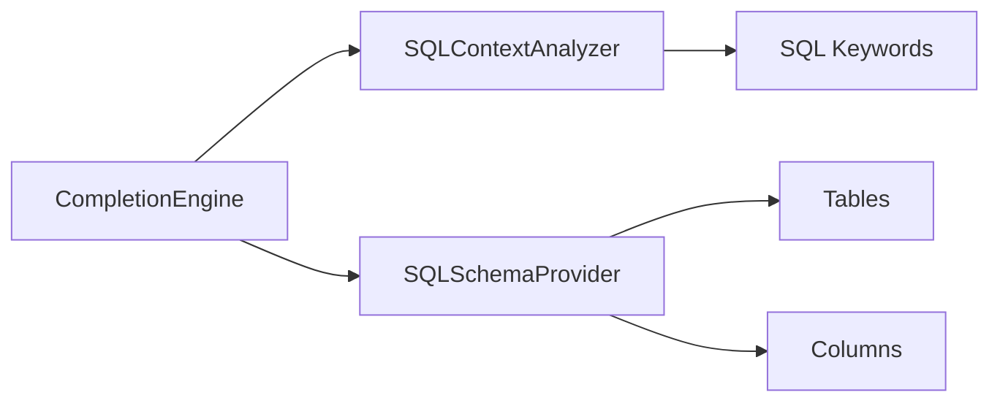
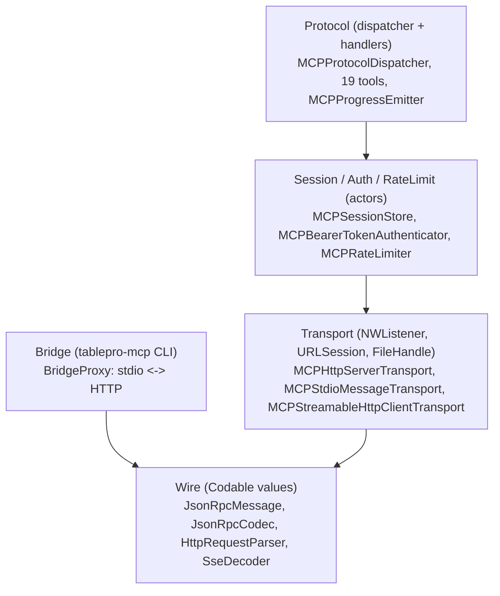
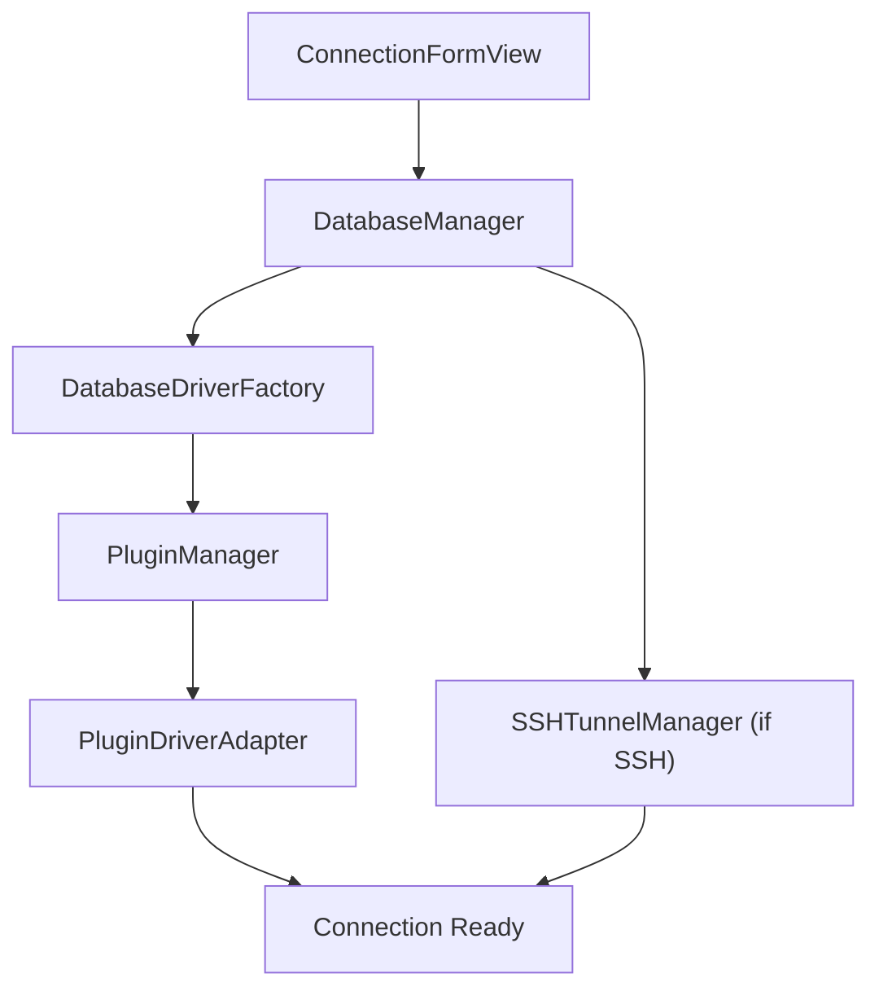
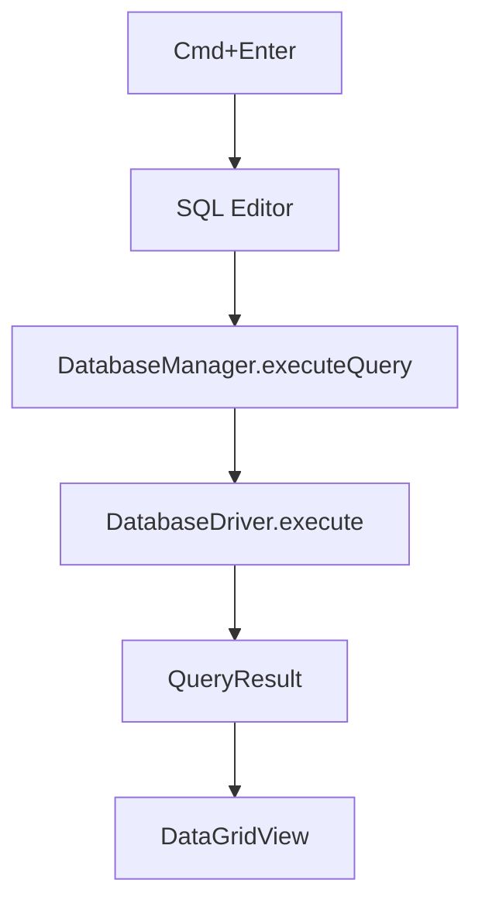

# Architecture

TablePro is built with:

- **SwiftUI** for the UI layer
- **AppKit** for low-level macOS integration (windows, menus, native tabs)
- **Swift Concurrency** (async/await, actors) for all async work
- **Native C libraries** for database connectivity (linked as static `.a` files)

## Design Patterns

### MVVM

- **Models**: structs (value types, Codable)
- **ViewModels**: `@Observable` classes (Swift 5.9+)
- **Views**: SwiftUI, with AppKit bridging where needed

### Protocol-Oriented Drivers

All database connectivity goes through one protocol:

```swift
protocol DatabaseDriver: AnyObject {
    func connect() async throws
    func disconnect()
    func execute(query: String) async throws -> QueryResult
    func fetchTables() async throws -> [TableInfo]
    // ...
}
```

No switch statements on database type. No hardcoded driver list. Plugins register themselves, and the factory resolves them by `DatabaseType.pluginTypeId`.

### Actor Isolation

Thread-safe shared state uses Swift actors:

```swift
actor SSHTunnelManager {
    private var tunnels: [UUID: SSHTunnel] = [:]
    func createTunnel(connectionId: UUID, ...) async throws -> Int { ... }
}
```

## Dependencies

| Package | Purpose |
|---------|---------|
| CodeEditSourceEditor | Tree-sitter SQL editor |
| Sparkle (2.8.1) | Auto-update with EdDSA signing |
| OracleNIO | Oracle driver (SPM, used by OracleDriverPlugin) |

<Note>
CodeEditSourceEditor bundles a SwiftLint plugin, which is why `-skipPackagePluginValidation` is required for CLI builds.
</Note>

## Plugin System

All database drivers are `.tableplugin` bundles loaded at runtime. This keeps the app binary small and makes adding new databases a matter of dropping in a bundle.

**Key files:**

| Component | Location | Role |
|-----------|----------|------|
| TableProPluginKit | `Plugins/TableProPluginKit/` | Shared framework with `DriverPlugin` and `PluginDatabaseDriver` protocols |
| PluginManager | `Core/Plugins/PluginManager.swift` | Discovers, loads, version-checks plugin bundles |
| PluginDriverAdapter | `Core/Plugins/PluginDriverAdapter.swift` | Bridges `PluginDatabaseDriver` to core `DatabaseDriver` |
| DatabaseDriverFactory | `Core/Database/DatabaseDriver.swift` | Resolves `DatabaseType` to loaded plugin |

### Driver Plugins

| Plugin | Database Types | C Bridge | Distribution |
|--------|---------------|----------|--------------|
| MySQLDriverPlugin | MySQL, MariaDB | CMariaDB (libmariadb) | Built-in |
| PostgreSQLDriverPlugin | PostgreSQL, Redshift, CockroachDB | CLibPQ (libpq) | Built-in |
| SQLiteDriverPlugin | SQLite | Foundation sqlite3 | Built-in |
| ClickHouseDriverPlugin | ClickHouse | URLSession HTTP | Built-in |
| MSSQLDriverPlugin | SQL Server | CFreeTDS | Built-in |
| RedisDriverPlugin | Redis | CRedis | Built-in |
| MongoDBDriverPlugin | MongoDB | CLibMongoc | Registry |
| DuckDBDriverPlugin | DuckDB | CDuckDB | Registry |
| OracleDriverPlugin | Oracle | OracleNIO (SPM) | Registry |
| CassandraDriverPlugin | Cassandra, ScyllaDB | CCassandra | Registry |
| EtcdDriverPlugin | Etcd | gRPC/HTTP | Registry |
| CloudflareD1Plugin | Cloudflare D1 | URLSession HTTP | Registry |
| DynamoDBDriverPlugin | DynamoDB | AWS SDK | Registry |
| BigQueryDriverPlugin | BigQuery | URLSession REST | Registry |

Built-in plugins ship inside the app bundle. Registry plugins are downloaded on demand from the [plugin registry](/development/plugin-registry).

## Key Components

### DatabaseManager

Connection pool and lifecycle management. Primary interface between UI and drivers. Handles connect, disconnect, reconnect, and session tracking.

### ConnectionHealthMonitor

Pings active connections every 30 seconds. Auto-reconnects with exponential backoff on failure.

### Autocomplete Engine



- **CompletionEngine**: entry point, produces ranked suggestions
- **SQLContextAnalyzer**: parses cursor position context (table ref, column ref, keyword)
- **SQLSchemaProvider**: actor that caches and serves schema data

### MCP Layer

The MCP server lives under `Core/MCP/` and is split into five horizontal layers. Each layer talks only to the layer below it.



**Wire**: pure Codable types, no I/O. JSON-RPC 2.0, strict-CRLF HTTP, SSE encoder/decoder.

**Transport**: HTTP server uses `NWListener` and binds to `127.0.0.1:<port>` by default. The stream endpoints (`exchanges`, `listenerState`) are bounded `AsyncStream`s consumed by `MCPServerManager`. The bridge's client-side transport uses `URLSession.bytes(for:)` for incremental SSE.

**Session**: `MCPSessionStore` is an actor that owns session lifecycle. Idle timeout is 15 minutes. Token revocation marks sessions with `.tokenRevoked` and the SSE stream emits a typed terminate comment so clients can distinguish revoke from network blip.

**Protocol**: `MCPProtocolDispatcher` spawns a child `Task` per inbound exchange, so two concurrent tool calls run in parallel instead of queueing on the dispatcher actor. Per-request cancellation flows through `MCPInflightRegistry`. Long-running tools emit `notifications/progress` to clients that pass `_meta.progressToken`.

**Bridge**: `tablepro-mcp` is a 50-line composition root. `MCPStdioMessageTransport` host-side, `MCPStreamableHttpClientTransport` upstream. Errors land in os_log and stderr. The host-facing transport writes only validated `JsonRpcMessage` bytes to stdout.

The server accepts protocol versions `2025-03-26`, `2025-06-18`, and `2025-11-25`. See [Versioning](/external-api/versioning) for the negotiation rules and the additive-within-major-version stability policy.

## Data Flow

### Connection



### Query Execution



## State Management

| Pattern | What | Where |
|---------|------|-------|
| `@Observable` | UI state, sessions, active tab | ViewModels |
| `@AppStorage` | User preferences | Settings |
| Keychain | Connection passwords | ConnectionStorage |
| SQLite FTS5 | Query history (full-text search) | QueryHistoryStorage |
| JSON files | Tab state persistence | TabStateStorage |

## Directory Structure

<Tree>
  <Tree.Folder name="TablePro" defaultOpen>
    <Tree.Folder name="Core" defaultOpen>
      <Tree.Folder name="Database">
        <Tree.File name="DatabaseDriver.swift" />
        <Tree.File name="DatabaseManager.swift" />
      </Tree.Folder>
      <Tree.Folder name="Plugins">
        <Tree.File name="PluginManager.swift" />
        <Tree.File name="PluginDriverAdapter.swift" />
      </Tree.Folder>
      <Tree.Folder name="Services">
        <Tree.Folder name="Export" />
        <Tree.Folder name="Formatting" />
        <Tree.Folder name="Infrastructure" />
        <Tree.Folder name="Licensing" />
        <Tree.Folder name="Query" />
      </Tree.Folder>
      <Tree.Folder name="Utilities">
        <Tree.Folder name="Connection" />
        <Tree.Folder name="SQL" />
        <Tree.Folder name="File" />
        <Tree.Folder name="UI" />
      </Tree.Folder>
      <Tree.Folder name="Autocomplete" />
      <Tree.Folder name="SSH" />
      <Tree.Folder name="QuerySupport">
        <Tree.Folder name="MongoDB" />
        <Tree.Folder name="Redis" />
      </Tree.Folder>
    </Tree.Folder>
    <Tree.Folder name="Views">
      <Tree.Folder name="Connection" />
      <Tree.Folder name="Editor" />
      <Tree.Folder name="Main" />
      <Tree.Folder name="Results" />
      <Tree.Folder name="Settings" />
      <Tree.Folder name="Sidebar" />
    </Tree.Folder>
    <Tree.Folder name="Models">
      <Tree.Folder name="AI" />
      <Tree.Folder name="Connection" />
      <Tree.Folder name="Database" />
      <Tree.Folder name="Export" />
      <Tree.Folder name="Query" />
      <Tree.Folder name="Settings" />
      <Tree.Folder name="UI" />
      <Tree.Folder name="Schema" />
    </Tree.Folder>
    <Tree.Folder name="ViewModels" />
    <Tree.Folder name="Extensions" />
    <Tree.Folder name="Theme" />
    <Tree.Folder name="Resources" />
  </Tree.Folder>
  <Tree.Folder name="Plugins" defaultOpen>
    <Tree.Folder name="TableProPluginKit" />
    <Tree.Folder name="MySQLDriverPlugin" />
    <Tree.Folder name="PostgreSQLDriverPlugin" />
    <Tree.Folder name="SQLiteDriverPlugin" />
    <Tree.Folder name="ClickHouseDriverPlugin" />
    <Tree.Folder name="MSSQLDriverPlugin" />
    <Tree.Folder name="RedisDriverPlugin" />
    <Tree.File name="..." />
  </Tree.Folder>
  <Tree.Folder name="Libs" />
  <Tree.Folder name="TableProTests" />
  <Tree.Folder name="scripts" />
</Tree>
